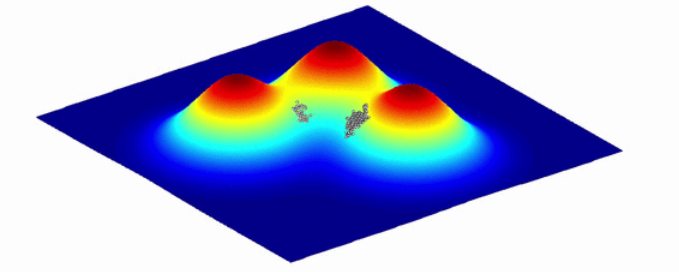

# DISEÑO, IMPLEMENTACIÓN Y EVALUACIÓN DE UN ALGORITMO EVOLUTIVO APLICADO A LA OPTIMIZACIÓN DE FUNCIONES REALES DE VARIAS VARIABLES

!!Algunos cambios hechos por el colaborador!!

## Breve Descripción

En matemáticas, ciencias de la computación, economía, etc., los **problemas de optimización** consisten en la selección de la mejor solución (con respecto a algún criterio determinado) de entre un conjunto de soluciones posibles.

En el caso más simple, el problema se reduce a minimizar o maximizar una función real eligiendo valores para las variables de entrada y calculando el valor de la función. Por convención suelen definirse como problemas de minimización, y si un criterio *f* debiera maximizarse, simplemente se minimiza su negación (*-f*).

Las aplicaciones de este tipo de problemas incluyen, pero no se limitan a:

* Economía y finanzas
* Matemáticas
* Química
* Redes y comunicaciones
* Mecánica

La complicación que presenta la optimización de funciones reales multivariables es que no siempre son derivables, o la derivada no es trivial. Aún más grave es el hecho de que pueden presentar multitud de mínimos locales o mesetas, que dificultan la exploración. Por supuesto la exploración completa del espacio de búsqueda es intratable cuando la cantidad de variables aumenta (recordar que la función no se limita exclusivamente a 3 variables). No existe además una heurística admisible que sirva para guiar la búsqueda, al menos no para cualquier función que se le presente.

Es por ello que se requiere otro tipo de algoritmos distintos a los deterministas, relajando la condición de optimalidad global para obtener una mayor rapidez. Se introducen entonces a los **Algoritmos Evolutivos** (AE) como una alternativa eficiente y robusta para la búsqueda de soluciones óptimas. Los mismos son algoritmos metaheurísticos basados en poblaciones que utilizan conceptos inspirados en la biología, como mutación, cruza, selección natural y supervivencia del más apto. Son en cierta forma estocásticos, dado que tienen un componente aleatorio.

Su efectividad y practicidad radica en los siguientes puntos:

* Sus características aleatorias hacen al método menos sensible a errores de modelado y en ocasiones le permiten escapar de óptimos locales.

* El hecho de mantener una población de soluciones candidatas también ayuda a escapar de óptimos locales, así como permite explorar espacios de búsqueda grandes y discontinuos.

* Poblaciones grandes ayudan en problemas/funciones con ruido.

* Tratan a la funcion objetivo como una caja negra, adaptandose así a varios tipos de problemas sin inconvenientes.

* La definición de la funcion objetivo usualmente requiere menos conocimiento de la estructura del problema que construir una heurística admisible.

Es sencillo además visualizar como la función a optimizar se puede mapear directamente con la función de aptitud (*fitness*) de cada individuo. Luego la población de soluciones posibles resolverá "naturalmente" el problema, al sobrevivir aquellas soluciones que se encuentren más cercanas al óptimo. Esto puede apreciarse en la siguiente imagen (cortesía de Wikipedia), donde los puntos blancos con borde negro son elementos de la población:

Existen además varios tipos de Algoritmos Evolutivos, siendo a grandes razgos los siguientes:

* **Algoritmos Genéticos**:las soluciones se codifican como cadenas de bits (1's y 0's) o enteros y buscan la solución mediante recombinación y mutación.

* **Estrategias Evolutivas**:muy similares a los anteriores, pero utilizan vectores de números reales para codificar las soluciones.

* **Programación Genética**: las soluciones son en forma de programas de computadora, y su *fitness* se determina por su habilidad para resolver un problema computacional concreto.

* **Programación Evolutiva**: similar a la anterior, solo que los programas solución son fijos y lo que evoluciona son los parámetros numéricos del mismo.

## Objetivos:

Las técnicas de optimización global no sólo son para encontrar el máximo o el mínimo de una única funcion *f*. En muchos problemas del mundo real se aplican en cambio a conjuntos *F* que consisten de *n* funciones objetivo $f_i$, cada una representando un criterio a ser optimizado. En estos casos los problemas suelen llamarse *multi-objetivo*. La optimización multi-objetivo suele significar balancear el compromiso entre varias metas que conflictúan entre sí.

El PFG se centrará en la resolución de problemas de optimización *simple-objetivo* de funciones de *n* variables mediante el uso de Algoritmos Evolutivos. Para ello se utilizaran Estrategias Evolutivas, aunque por posibles problemas de codificación pueden llegar a utilizarse Algoritmos Genéticos, ambos muy similares.

Estos algoritmos intercambian la exactitud asegurada por una mayor rapidez para obtener la solución. Esto no quiere decir que la solución sea incorrecta, sólo que podría no ser el óptimo global. Para solventar este problema existen disintas altenativas para cada una de las fases del algoritmo (codificación, selección, cruza, mutación, etc), contribuyendo cada una de ellas de distintas formas de cara a resolver el problema. Es difícil detectar *a priori* como se comportará el algoritmo con cada una de estas alternativas, necesitándose normalmente de muchas pruebas empíricas para determinar la efectividad de cada una de ellas. Es por ello que se elegirá una de las fases del algoritmo y se evaluarán  implementaciones alternativas desde un punto de vista computacional.

## Método de desarrollo, fases del trabajo y fechas de realización:

Las fases de desarrollo del PFG consistirán a grandes razgos de las fases de preparación, implementación, evaluación y pulido final.

La fase de **preparación** corresponde con el primer cuatrimestre del curso 2014/2015. En ella se adquirirá la base teórica necesaria, se investigará el estado del arte, patrones de diseño y tecnologías disponibles. Si bien el desarrollo del algoritmo evolutivo se hará desde cero, se contempla el uso de liberías de código abierto (preferentemente disponibles en Internet) y herramientas colaborativas como *Google Code, GitHub, SourceForge*, etc. para las partes secundarias/auxiliares.De alcanzar el tiempo se incluirá en esta fase un diseño inicial del algoritmo. De lo contrario se pospondrá al segundo cuatrimestre.

La fase de **implementación** tendrá curso durante el segundo cuatrimestre. En ella se terminará el diseño y se realizará la codificación del algoritmo básico. El mismo se ejecutará y configurará desde la linea de comandos. Para probarlo se utilizarán funciones matemáticas escritas en el propio lenguaje de programación, y se verificará su correcto funcionamiento mediante pruebas unitarias. Dado que las soluciones no son exactas, se comparará el resultado del algoritmo con soluciones conocidas, obtenidas mediante otros medios, y se ajustará el algoritmo hasta un margen de error que se considere pertinente.

Luego de la anterior, y durante el mismo cuatrimestre, se realizará la fase de **evaluación**. En ella se dotará al algoritmo de distintas métricas como pueden ser la rapidez de convergencia, *fitness* promedio, tiempo de ejecución, etc. Se correrán varias pruebas empíricas, anotando los resultados y comparándolos. También se elegirá una fase del algoritmo y se codificarán distintas variantes, probando y comparando cada una de ellas. El resultado de esta fase será un analisis comparativo con gráficos y conclusiones escritas.

De disponerse más tiempo, se incluirá una fase extra de **pulido final**, durante el cuatrimestre o hasta el mes de Septiembre. El objetivo principal de esta es dotar al sistema de una interfaz gráfica (via Web/HTTP en un navegador o de escritorio) aún sin definir. Mínimamente se debería poder ingresar los parámetros para el algoritmo, asi como mostrar la solución básica. Será deseable poder mostrar además de la solución, el rendimiento de las distintas fases, la evolución de las generaciones y algunos otros datos de interés, útiles para las comparativas. Una funcionalidad extra, deseable pero opcional (*Nice To Have*), será que el usuario pueda ingresar cualquier función a evaluar con cualquier cantidad de variables mediante la interfaz gráfica, sin que sea necesario recompilar el código.

## Medios a utilizar y breve justificación de la pertinencia de los mismos:

Para adquirir la base teórica necesaria sobre computación evolutiva, se utilizará como bibliografía base el libro:

	“Introduction to Evolutionary Computing”
	A. E. Eiben y J. E. Smith
	Springer, 2007, Impresión corregida de la 1a edición de 2003

Se utilizarán también recursos obtenidos de Internet, sean publicaciones, código abierto, etc.

La programación se realizará enteramente en Java 1.6, por la comunidad, librerías y código abierto disponible. Además de poseer un modelo de objetos avanzado y moderno es multiplataforma, requisito indispensable dado que el entorno de desarrollo será Linux y se deba soportar también Windows.

En cuanto a librerías se utilizarán, de ser necesarias, Jetty (servidor HTTP), Swing (Interfaces gráficas) y ANTLr (parser de gramáticas), entre otras.

Para el manejo, revisión y versionado de código se utilizará la plataforma GitHub, con intención de facilitar el acceso y distribución del código, la documentación y la memoria, tanto con el Director del proyecto como con todo el alumnado y otras terceras partes. Puede accederse al repositorio libremente en el siguiente enlace: 
